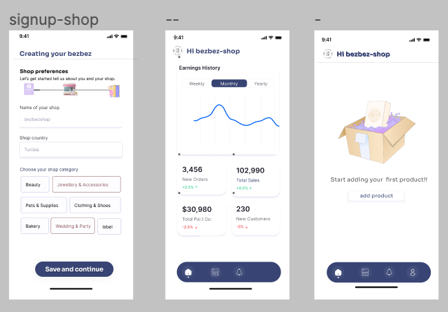

# Bezbez for small business

## Figma interfaces

## Getting Started

1. **frontend**

- Clone the Repository : `$ git clone https://github.com/hadily/bezbez-app.git``
- Navigate to Client Directory : `$ cd client``
- Install Dependencies : `$ npm install``
- Start the ionic server : `$ ionic serve`

2. **Backend**

2.1 **Setting up the Virtual Environment:**
// The virtual enviroment is set for depedencies and versions of the project to be isolated from the rest //
   - Make sure you're in `bezbez-app` directory
   - Make sure you have python installed `python3 --version` 
   - Create a virtual environment  ` $ python3 venv venv`
   - Activate the virtual environment: `$ source venv/bin/activate`
   - create a `.gitignore ` file under the `venv`  folder

   From now on any modification on the server should be done after activating the venv

**2. Download and set up Postgres**
   - go to `https://postgresapp.com/downloads.html`and download postgres 13
   - add the app into your `Applications` folder and initialize it
   - To use command line tools (like psql) from your Terminal, add Postgres.app’s bin folder to your $PATH:
   You can do this with the following command:
   `sudo mkdir -p /etc/paths.d && echo /Applications/Postgres.app/Contents/Versions/latest/bin | sudo tee /etc/paths.d/postgresapp`

2.2 **Setting up the PostgreSQL  server:**
   - Access  Pgadmin
   - Create database `bezbez`
   - set the credentials data in settings.py 

2.3 **Back to the Django Project:**
   - After configuring postgreSQL, return to your Django project directory.
   - Run Django's `$ python manage.py makemigrations` command to create migrations based on the changes you've made to your models.
   - Apply the migrations to the database using `$ python manage.py migrate`.
   - Finally, start the Django development server with `$ python manage.py runserver`.

